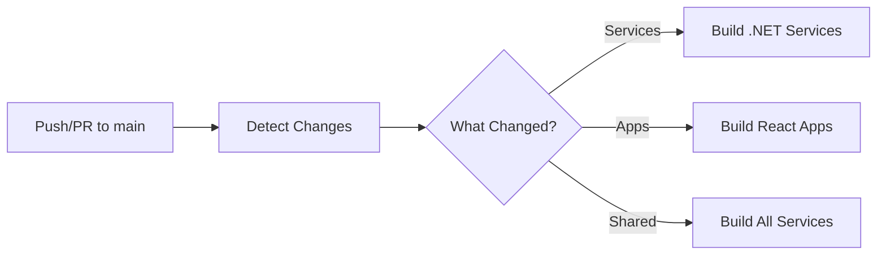

# GitHub Actions CI/CD Workflows

This repository uses GitHub Actions to automatically build and test microservices and React applications. The workflows are designed with **smart change detection** to only build what has been modified, reducing build times and resource usage.

## 📁 Workflow Files

- **`.github/workflows/ci.yml`** - Main CI workflow with change detection
- **`.github/workflows/build-services.yml`** - Reusable workflow for .NET services
- **`.github/workflows/build-react-apps.yml`** - Reusable workflow for React apps
- **`.github/workflows/docker-image.yml`** - Docker image build & push to Docker Hub 🐳

## 🚀 How It Works

### Change Detection

The main CI workflow uses `dorny/paths-filter` to detect which parts of the codebase have been modified. Based on the detected changes, it triggers the appropriate build workflows.



### Supported Services

The following .NET microservices are supported:

- **Catalog Service** - Product catalog management
- **Basket Service** - Shopping cart functionality
- **Order Service** - Order processing
- **Discount Service** - Discount and coupon management
- **Inventory Service** - Stock management
- **Notification Service** - Notification handling
- **Search Service** - Product search
- **Report Service** - Reporting and analytics

### Infrastructure Components

- **API Gateway** - YARP reverse proxy
- **Job Orchestrator** - Quartz.NET job scheduling

### React Applications

- **App.Store** - Customer-facing storefront
- **App.Admin** - Admin dashboard

## 📝 Build Scenarios

### Scenario 1: Only Catalog Service Changed

```
Modified: src/Services/Catalog/Api/Catalog.Api/Program.cs
Result: ✅ Build only Catalog Service
```

### Scenario 2: Shared Code Changed

```
Modified: src/Shared/BuildingBlocks/CQRS/ICommand.cs
Result: ✅ Build ALL services (because shared code affects all)
```

### Scenario 3: React App Changed

```
Modified: src/Apps/App.Store/src/components/Header.jsx
Result: ✅ Build only App.Store
```

### Scenario 4: Multiple Services Changed

```
Modified: 
  - src/Services/Catalog/Core/Catalog.Application/...
  - src/Services/Basket/Api/Basket.Api/...
  - src/Apps/App.Admin/src/pages/Dashboard.jsx
Result: ✅ Build Catalog, Basket services and App.Admin in parallel
```

## ⚙️ Configuration

### .NET Configuration
- **Version**: .NET 8.x
- **Build Mode**: Release
- **Cache**: NuGet packages cached at `~/.nuget/packages`
- **Restore**: Dependencies restored before build

### React Configuration
- **Node Version**: 20.x (LTS)
- **Package Manager**: npm
- **Build Command**: `npm run build`
- **Lint**: Runs if available (continues on error)
- **Cache**: npm dependencies cached automatically

## 🎯 Triggering Workflows

Workflows are automatically triggered on:

- **Push to `main`** branch
- **Pull Requests** targeting `main` branch

## 📊 Build Artifacts

React app builds are uploaded as artifacts and retained for 7 days:

- `app-store-build` - Built App.Store files from `dist/`
- `app-admin-build` - Built App.Admin files from `dist/`

## 🔍 Viewing Build Results

After a workflow runs, you can view:

1. **Build Summary** - Shows which components were detected as changed
2. **Individual Job Logs** - Detailed logs for each service/app build
3. **Artifacts** - Download built React apps from the Actions tab

## 💡 Benefits

✅ **Fast Builds** - Only build what changed
✅ **Parallel Execution** - Multiple services build simultaneously
✅ **Smart Caching** - NuGet and npm dependencies are cached
✅ **Resource Efficient** - Saves CI/CD minutes
✅ **Clear Feedback** - Build summary shows what was built

## 🛠️ Local Testing

To test builds locally before pushing:

### .NET Services
```bash
# Test Catalog service
dotnet restore src/Services/Catalog/Api/Catalog.Api/Catalog.Api.csproj
dotnet build src/Services/Catalog/Api/Catalog.Api/Catalog.Api.csproj --configuration Release

# Test API Gateway
dotnet restore src/ApiGateway/YarpApiGateway/YarpApiGateway.csproj
dotnet build src/ApiGateway/YarpApiGateway/YarpApiGateway.csproj --configuration Release
```

### React Apps
```bash
# Test App.Store
cd src/Apps/App.Store
npm install
npm run lint
npm run build

# Test App.Admin
cd src/Apps/App.Admin
npm install
npm run build
```

## 🔧 Customization

### Adding a New Service

To add a new microservice to the workflow:

1. Add path filter in `.github/workflows/ci.yml`:
```yaml
new-service:
  - 'src/Services/NewService/**'
```

2. Add output in `detect-changes` job:
```yaml
outputs:
  new-service: ${{ steps.filter.outputs.new-service }}
```

3. Add input in `build-services` job condition:
```yaml
needs.detect-changes.outputs.new-service == 'true' ||
```

4. Add workflow input in `build-services.yml`:
```yaml
inputs:
  build-new-service:
    required: true
    type: boolean
```

5. Add build job in `build-services.yml`:
```yaml
build-new-service:
  name: Build New Service
  if: inputs.build-new-service == true
  runs-on: ubuntu-latest
  steps:
    # ... build steps
```

### Modifying .NET or Node Version

Update the version in both workflow files:

**For .NET:**
```yaml
- name: Setup .NET 8
  uses: actions/setup-dotnet@v4
  with:
    dotnet-version: '8.x'  # Change this
```

**For Node:**
```yaml
- name: Setup Node.js 20
  uses: actions/setup-node@v4
  with:
    node-version: '20.x'  # Change this
```

## 📚 Additional Resources

- [GitHub Actions Documentation](https://docs.github.com/en/actions)
- [dorny/paths-filter Action](https://github.com/dorny/paths-filter)
- [.NET GitHub Actions](https://github.com/actions/setup-dotnet)
- [Node.js GitHub Actions](https://github.com/actions/setup-node)

---

## 🐳 Docker Image CI Workflow

The **`docker-image.yml`** workflow automatically builds and pushes Docker images to Docker Hub for all microservices and frontend applications - **but only when they change**.

### 🎯 Key Features

✅ **Smart Change Detection** - Only builds images for modified services  
✅ **Parallel Builds** - All changed services build simultaneously  
✅ **Docker Layer Caching** - Speeds up builds by reusing unchanged layers  
✅ **Dual Tagging** - Images tagged with both `latest` and commit SHA  
✅ **Cost Efficient** - Saves Docker Hub storage and CI/CD minutes  

### 📦 Supported Components (26 Total)

#### Backend Services (24 microservices)

| Service | Images |
|---------|--------|
| **Basket** | `basket-api`, `basket-worker-outbox` |
| **Catalog** | `catalog-api`, `catalog-grpc`, `catalog-worker-outbox`, `catalog-worker-consumer` |
| **Communication** | `communication-api` |
| **Discount** | `discount-api`, `discount-grpc` |
| **Inventory** | `inventory-api`, `inventory-grpc`, `inventory-worker-consumer`, `inventory-worker-outbox` |
| **Notification** | `notification-api`, `notification-worker-consumer`, `notification-worker-processor` |
| **Order** | `order-api`, `order-grpc`, `order-worker-outbox`, `order-worker-consumer` |
| **Report** | `report-api`, `report-grpc` |
| **Search** | `search-api`, `search-worker-consumer` |

#### Frontend Apps (2 applications)

- `app-admin` - Admin dashboard (Vite + React + Nginx)
- `app-store` - Customer storefront (Vite + React + Nginx)

### 🔧 Setup Requirements

#### 1. Create Docker Hub Access Token

1. Log in to [Docker Hub](https://hub.docker.com/)
2. Navigate to **Account Settings** → **Security**
3. Click **New Access Token**
4. Name: `github-actions` (or similar)
5. Permissions: **Read & Write**
6. Copy the generated token (shown only once!)

#### 2. Configure GitHub Secrets

Go to your repository on GitHub:

**Settings** → **Secrets and variables** → **Actions** → **New repository secret**

**Required Secret:**

| Secret Name | Value | Description |
|-------------|-------|-------------|
| `DOCKERHUB_TOKEN` | `dckr_pat_xxxxx...` | Your Docker Hub access token |

**Optional Secrets** (for frontend apps only):

| Secret Name | Example Value | Required For |
|-------------|---------------|--------------|
| `VITE_KEYCLOAK_URL` | `https://auth.example.com` | App.Admin, App.Store |
| `VITE_KEYCLOAK_REALM` | `shopping-cart` | App.Admin, App.Store |
| `VITE_KEYCLOAK_CLIENT_ID` | `store-app` | App.Admin, App.Store |
| `VITE_KEYCLOAK_REDIRECT_URI` | `https://store.example.com` | App.Admin, App.Store |
| `VITE_KEYCLOAK_BASE_URL` | `https://auth.example.com/realms/cart` | App.Admin, App.Store |
| `VITE_API_GATEWAY` | `https://api.example.com` | App.Admin, App.Store |

#### 3. Configure GitHub Variable

**Settings** → **Secrets and variables** → **Actions** → **Variables** tab → **New repository variable**

| Variable Name | Value | Description |
|---------------|-------|-------------|
| `DOCKERHUB_USERNAME` | `progcoder` | Your Docker Hub username |

### 🏷️ Image Naming Convention

All images follow this pattern:

```
progcoder/<service-name>:<tag>
```

**Examples:**
- `progcoder/basket-api:latest`
- `progcoder/basket-api:abc1234` (commit SHA)
- `progcoder/catalog-grpc:latest`
- `progcoder/app-admin:latest`

### 📋 Usage Examples

#### Example 1: Modify Only Basket Service

```bash
# Make changes to Basket service
git add src/Services/Basket/
git commit -m "feat: add basket expiration logic"
git push origin main
```

**Result:** Only these images are built and pushed:
- ✅ `progcoder/basket-api:latest`
- ✅ `progcoder/basket-api:<commit-sha>`
- ✅ `progcoder/basket-worker-outbox:latest`
- ✅ `progcoder/basket-worker-outbox:<commit-sha>`

#### Example 2: Modify Shared Code

```bash
# Update shared utilities
git add src/Shared/BuildingBlocks/
git commit -m "refactor: improve error handling in CQRS"
git push origin main
```

**Result:** ⚠️ **ALL 24 microservices** are rebuilt (they all depend on shared code)

#### Example 3: Modify Frontend Only

```bash
# Update admin dashboard
git add src/Apps/App.Admin/
git commit -m "ui: redesign login page"
git push origin main
```

**Result:** Only frontend image is built:
- ✅ `progcoder/app-admin:latest`
- ✅ `progcoder/app-admin:<commit-sha>`

#### Example 4: Multiple Services Changed

```bash
# Update multiple services
git add src/Services/Basket/ src/Services/Order/
git commit -m "feat: integrate basket with order service"
git push origin main
```

**Result:** All Basket and Order images are built in parallel:
- ✅ `basket-api`, `basket-worker-outbox`
- ✅ `order-api`, `order-grpc`, `order-worker-outbox`, `order-worker-consumer`

### 🎬 Workflow Triggers

The workflow runs on:

| Event | Behavior |
|-------|----------|
| **Push to `main`** | Builds AND pushes images to Docker Hub |
| **Pull Request to `main`** | Builds images (validates) but does NOT push |

### 📊 Monitoring Builds

1. Go to **Actions** tab in GitHub
2. Click on the latest **Docker Image CI** workflow run
3. View the **detect-changes** job to see what was detected
4. Check individual build jobs for logs and status

Each job will show:
- ✅ **Success** - Image built and pushed
- ⏭️ **Skipped** - No changes detected
- ❌ **Failed** - Check logs for errors

### 🚢 Deploying Images

Pull images from Docker Hub:

```bash
# Pull latest version
docker pull progcoder/basket-api:latest

# Pull specific version (recommended for production)
docker pull progcoder/basket-api:abc1234567

# Run the image
docker run -d -p 8080:8080 progcoder/basket-api:latest
```

### 🐛 Troubleshooting

#### ❌ Error: "unauthorized: incorrect username or password"

**Cause:** Invalid or missing Docker Hub credentials

**Fix:**
1. Verify `DOCKERHUB_TOKEN` secret exists
2. Regenerate token if needed (may have expired)
3. Ensure token has **Read & Write** permissions

#### ❌ Error: "Dockerfile not found"

**Cause:** Dockerfile path is incorrect

**Fix:**
1. Check that Dockerfile exists at expected location
2. Verify path in workflow matches actual file location

#### ❌ Frontend builds fail with environment errors

**Cause:** Missing `VITE_*` secrets

**Fix:**
1. Add all required frontend secrets (see setup section)
2. Verify secret names match exactly (case-sensitive)

#### ⚠️ All services rebuilding unexpectedly

**Cause:** Changes detected in `src/Shared/**` or `src/Directory.*.props`

**Expected Behavior:** This is correct - shared code affects all services

### 💡 Best Practices

1. **Use Specific Tags in Production**
   ```yaml
   # ✅ Good - Use commit SHA for production
   image: progcoder/basket-api:abc1234
   
   # ❌ Avoid - Don't use 'latest' in production
   image: progcoder/basket-api:latest
   ```

2. **Test Locally First**
   ```bash
   # Build Docker image locally before pushing
   docker build -f src/Services/Basket/Api/Basket.Api/Dockerfile -t basket-api .
   docker run -p 8080:8080 basket-api
   ```

3. **Monitor Build Logs**
   - Always check the Actions tab after pushing
   - Review logs for any warnings or errors
   - Verify images appear on Docker Hub

4. **Keep Secrets Secure**
   - Never commit secrets to the repository
   - Rotate Docker Hub tokens periodically
   - Use separate tokens for different environments

### 🔄 Adding a New Service

To add a new microservice to the Docker workflow:

1. **Add change detection filter:**
   ```yaml
   # In detect-changes job outputs
   new-service: ${{ steps.changes.outputs.new-service }}
   ```

2. **Add path filter:**
   ```yaml
   # In filters section
   new-service:
     - 'src/Services/NewService/**'
     - 'src/Shared/**'
     - 'src/Directory.*.props'
   ```

3. **Add build job:**
   ```yaml
   build-new-service:
     needs: detect-changes
     if: needs.detect-changes.outputs.new-service == 'true'
     runs-on: ubuntu-latest
     steps:
       # ... standard build steps
   ```

---

## 📝 Pull Request Template

This repository includes a single, unified PR template at `.github/pull_request_template.md`.

### How to Use

When you create a PR, the template automatically appears. Simply:

1. **Select your change type** (Backend/UI/Infrastructure/etc.)
2. **Uncomment the relevant checklist** (remove `<!--` and `-->`)
3. **Fill in the sections**
4. **Add screenshots** if it's a UI change (REQUIRED!)

### UI Changes - Screenshot Requirements

⚠️ **MANDATORY for any UI changes:**
- Desktop view (1920x1080)
- Mobile view (375x667)
- Before/After comparison (if modifying existing UI)

### Key Standards

**Backend:**
- Use `MessageCode` constants (NO hardcoded strings)
- Follow CQRS pattern
- Add FluentValidation validators
- Naming: `XxxCommand`, `XxxQuery`, `XxxEntity`

**Frontend:**
- ALL text uses `t("key")` i18n (NO hardcoded text)
- API calls in `/services`
- Forms use Formik + Yup
- Catch blocks: `console.error()` ONLY (NO toast)

---

**Note**: These workflows are configured for build-only mode (no tests). To add testing, modify the workflow files to include test steps after the build steps.

