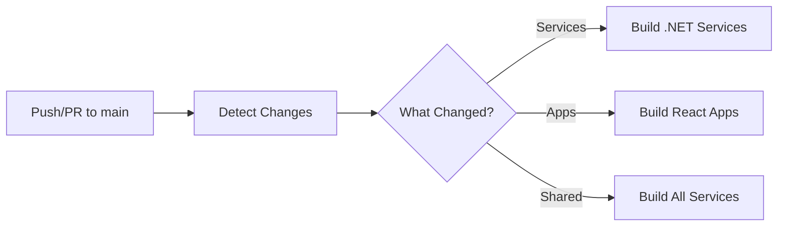

# GitHub Actions CI/CD Workflows

This repository uses GitHub Actions to automatically build and test microservices and React applications. The workflows are designed with **smart change detection** to only build what has been modified, reducing build times and resource usage.

## 📁 Workflow Files

- **`.github/workflows/ci.yml`** - Main CI workflow with change detection
- **`.github/workflows/build-services.yml`** - Reusable workflow for .NET services
- **`.github/workflows/build-react-apps.yml`** - Reusable workflow for React apps

## 🚀 How It Works

### Change Detection

The main CI workflow uses `dorny/paths-filter` to detect which parts of the codebase have been modified. Based on the detected changes, it triggers the appropriate build workflows.



### Supported Services

The following .NET microservices are supported:

- **Catalog Service** - Product catalog management
- **Basket Service** - Shopping cart functionality
- **Order Service** - Order processing
- **Discount Service** - Discount and coupon management
- **Inventory Service** - Stock management
- **Notification Service** - Notification handling
- **Search Service** - Product search
- **Report Service** - Reporting and analytics

### Infrastructure Components

- **API Gateway** - YARP reverse proxy
- **Job Orchestrator** - Quartz.NET job scheduling

### React Applications

- **App.Store** - Customer-facing storefront
- **App.Admin** - Admin dashboard

## 📝 Build Scenarios

### Scenario 1: Only Catalog Service Changed

```
Modified: src/Services/Catalog/Api/Catalog.Api/Program.cs
Result: ✅ Build only Catalog Service
```

### Scenario 2: Shared Code Changed

```
Modified: src/Shared/BuildingBlocks/CQRS/ICommand.cs
Result: ✅ Build ALL services (because shared code affects all)
```

### Scenario 3: React App Changed

```
Modified: src/Apps/App.Store/src/components/Header.jsx
Result: ✅ Build only App.Store
```

### Scenario 4: Multiple Services Changed

```
Modified: 
  - src/Services/Catalog/Core/Catalog.Application/...
  - src/Services/Basket/Api/Basket.Api/...
  - src/Apps/App.Admin/src/pages/Dashboard.jsx
Result: ✅ Build Catalog, Basket services and App.Admin in parallel
```

## ⚙️ Configuration

### .NET Configuration
- **Version**: .NET 8.x
- **Build Mode**: Release
- **Cache**: NuGet packages cached at `~/.nuget/packages`
- **Restore**: Dependencies restored before build

### React Configuration
- **Node Version**: 20.x (LTS)
- **Package Manager**: npm
- **Build Command**: `npm run build`
- **Lint**: Runs if available (continues on error)
- **Cache**: npm dependencies cached automatically

## 🎯 Triggering Workflows

Workflows are automatically triggered on:

- **Push to `main`** branch
- **Pull Requests** targeting `main` branch

## 📊 Build Artifacts

React app builds are uploaded as artifacts and retained for 7 days:

- `app-store-build` - Built App.Store files from `dist/`
- `app-admin-build` - Built App.Admin files from `dist/`

## 🔍 Viewing Build Results

After a workflow runs, you can view:

1. **Build Summary** - Shows which components were detected as changed
2. **Individual Job Logs** - Detailed logs for each service/app build
3. **Artifacts** - Download built React apps from the Actions tab

## 💡 Benefits

✅ **Fast Builds** - Only build what changed
✅ **Parallel Execution** - Multiple services build simultaneously
✅ **Smart Caching** - NuGet and npm dependencies are cached
✅ **Resource Efficient** - Saves CI/CD minutes
✅ **Clear Feedback** - Build summary shows what was built

## 🛠️ Local Testing

To test builds locally before pushing:

### .NET Services
```bash
# Test Catalog service
dotnet restore src/Services/Catalog/Api/Catalog.Api/Catalog.Api.csproj
dotnet build src/Services/Catalog/Api/Catalog.Api/Catalog.Api.csproj --configuration Release

# Test API Gateway
dotnet restore src/ApiGateway/YarpApiGateway/YarpApiGateway.csproj
dotnet build src/ApiGateway/YarpApiGateway/YarpApiGateway.csproj --configuration Release
```

### React Apps
```bash
# Test App.Store
cd src/Apps/App.Store
npm install
npm run lint
npm run build

# Test App.Admin
cd src/Apps/App.Admin
npm install
npm run build
```

## 🔧 Customization

### Adding a New Service

To add a new microservice to the workflow:

1. Add path filter in `.github/workflows/ci.yml`:
```yaml
new-service:
  - 'src/Services/NewService/**'
```

2. Add output in `detect-changes` job:
```yaml
outputs:
  new-service: ${{ steps.filter.outputs.new-service }}
```

3. Add input in `build-services` job condition:
```yaml
needs.detect-changes.outputs.new-service == 'true' ||
```

4. Add workflow input in `build-services.yml`:
```yaml
inputs:
  build-new-service:
    required: true
    type: boolean
```

5. Add build job in `build-services.yml`:
```yaml
build-new-service:
  name: Build New Service
  if: inputs.build-new-service == true
  runs-on: ubuntu-latest
  steps:
    # ... build steps
```

### Modifying .NET or Node Version

Update the version in both workflow files:

**For .NET:**
```yaml
- name: Setup .NET 8
  uses: actions/setup-dotnet@v4
  with:
    dotnet-version: '8.x'  # Change this
```

**For Node:**
```yaml
- name: Setup Node.js 20
  uses: actions/setup-node@v4
  with:
    node-version: '20.x'  # Change this
```

## 📚 Additional Resources

- [GitHub Actions Documentation](https://docs.github.com/en/actions)
- [dorny/paths-filter Action](https://github.com/dorny/paths-filter)
- [.NET GitHub Actions](https://github.com/actions/setup-dotnet)
- [Node.js GitHub Actions](https://github.com/actions/setup-node)

---

## 📝 Pull Request Template

This repository includes a single, unified PR template at `.github/pull_request_template.md`.

### How to Use

When you create a PR, the template automatically appears. Simply:

1. **Select your change type** (Backend/UI/Infrastructure/etc.)
2. **Uncomment the relevant checklist** (remove `<!--` and `-->`)
3. **Fill in the sections**
4. **Add screenshots** if it's a UI change (REQUIRED!)

### UI Changes - Screenshot Requirements

⚠️ **MANDATORY for any UI changes:**
- Desktop view (1920x1080)
- Mobile view (375x667)
- Before/After comparison (if modifying existing UI)

### Key Standards

**Backend:**
- Use `MessageCode` constants (NO hardcoded strings)
- Follow CQRS pattern
- Add FluentValidation validators
- Naming: `XxxCommand`, `XxxQuery`, `XxxEntity`

**Frontend:**
- ALL text uses `t("key")` i18n (NO hardcoded text)
- API calls in `/services`
- Forms use Formik + Yup
- Catch blocks: `console.error()` ONLY (NO toast)

---

**Note**: These workflows are configured for build-only mode (no tests). To add testing, modify the workflow files to include test steps after the build steps.

